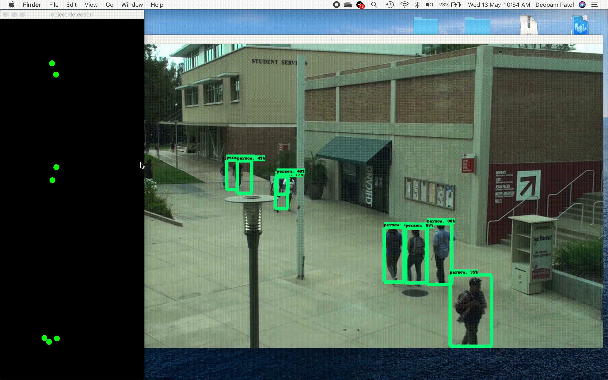

# Birds Eye
___



### Perspective Transform 

In Perspective Transformation, we can change the perspective of a given image or video for getting better insights about the required information. In Perspective Transformation, we need provide the points on the image from which want to gather information by changing the perspective. We also need to provide the points inside which we want to display our image. Then, we get the perspective transform from the two given set of points and wrap it with the original image.

##### Example : A side view perspective change.
<table>
  <tr>
    <td>Tilted View of window</td>
     <td>Changed Perpective</td>
  </tr>
  <tr>
    <td></td>
    <td></td>
  </tr>
 </table>
For perspective transformation, you need a 3x3 transformation matrix. Straight lines will remain straight even after the transformation. To find this transformation matrix, you need 4 points on the input image and corresponding points on the output image. Among these 4 points, 3 of them should not be collinear. Then transformation matrix can be found by the function cv2.getPerspectiveTransform. Then apply cv2.warpPerspective with this 3x3 transformation matrix.


#### To get the Transformation Matrix

Install requirements
```bash
pip install -r requirements.txt
```

Run this command and select four points on the image. 
In the order (TopLeft, TopRight, BottomLeft, BottomRight)
```bash
python calliberate.py --image calliberation_image.jpg 
```


The output will be a numpy .npy transformation matrix file. Which you can use for further development.


#### Example application of perspective change:
In this case i have used the above created matrix file to change the side tilted view of the camera into top(Birds eye) view. I used a person detection model to detect the person in the frame. The detections are in the form of rectangle co-ordinates (xmin,ymin, xmax, ymax). I selected the bottom coordinate of rectangle and transformed its view to top view to get a point representation of the person using the transformation matrix.


To run the example : 
```bash
cd examples/movements/
python person_birds_eye.py 
```

In the above example the dots on black screen are the top view of people walking in the video. The flickering is because of the accuracy of the model that is used. This experiment was done using an ssd_mobilenet model. To use a model with higher accuracy in person detection task change this [line](https://github.com/deepampatel/BirdsEye/blob/master/examples/movements/person_birds_eye.py#L27).


